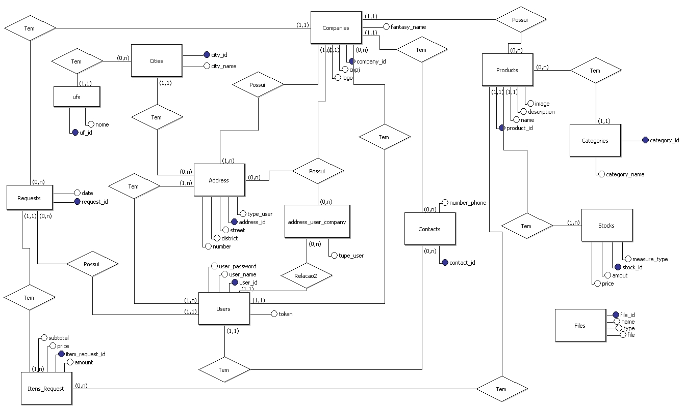
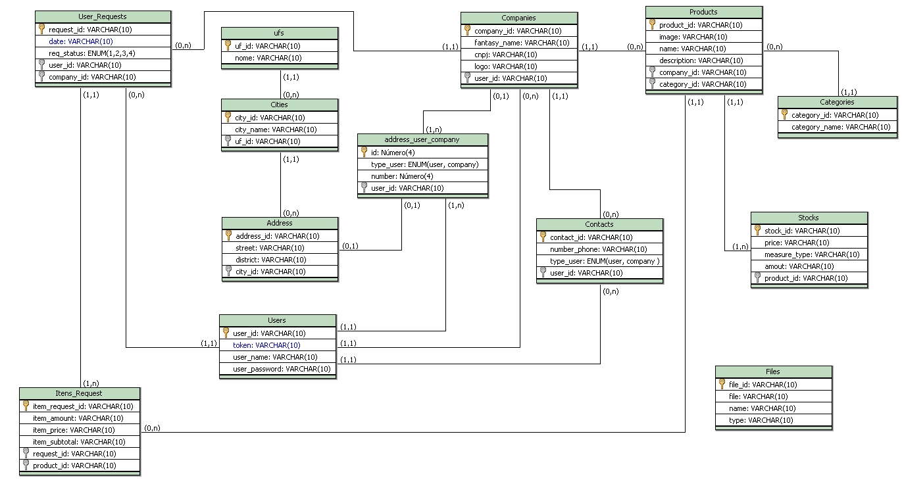

# Application REST - Adonis API

A aplicação REST de todo o sistema.

1. [NPM install](#installation)
2. [Run application](#pushpin-run-app)
3. [Access](#pushpin-access)
4. [Database Documentaion](#database-documentation)

## __Installation__

## :pushpin: Clone the reposity

```git
git clone https://github.com/[YOUT_USER_NAME]/apirest
```
## :pushpin: Install with npm
Use the npm command to install the packges node

```bash
npm install
```

## :pushpin: Run App

Use the adonis command run and start the application

```bash
adonis serve --dev
```

### :pushpin: Access

Access, in browser, the address http://127.0.0.1:[PORT_NAME]

---

# Database Documentation

# __Conceitual Model:__


# __Logic Model:__


---
> ## Entities:

- [Address](#pushpin-address)
- [Categories](#pushpin-categories)
- [Cities](#pushpin-cities)
- [Companies](#pushpin-companies)
- [Files](#pushpin-files)
- [Contacts](#pushpin-contacts)
- [Itens_Request](#pushpin-itens_request)
- [Products](#pushpin-products)
- [User_Requests](#pushpin-user_requests)
- [Stocks](#pushpin-stocks)
- [Users](#pushpin-users)
- [Ufs](#pushpin-ufs)

## Below, is __description__ from entities databases in System.

# :pushpin: Address 

## Description
>``This table is accountable for register address of the system users.``

## Attributes
  - __address_id__ 
  - street
  - district 
  - city_id 
---
# :pushpin: Address_User_Company

## Description
>``This table is accountable for register address of the system users.``

## Attributes
  - __add_id__ 
  - type_user : _ENUM(user, company)_
  - number (O número da casa) 
  - __user_id__ 
---

# :pushpin: Categories

## Description
> `` Esta tabela é responsável por cadastrar as categorias dos produtos.``

## Attributes
  - __category_id__ 
  - category_name

----

# :pushpin: Cities

## Description
> `` Esta tabela terá as cidades já pré-cadastradas, no sistema. Por meio dessa tabela...``

## Attributes
  - __city_id__ 
  - city_name
  - __uf_id__ 
---

# :pushpin: Companies

## Description
> `` Esta tabela é responsável por cadastrar as empresas.``

## Attributes
  - __company_id__ 
  - fantasy_name
  - cnpj
  - logo
  - __user_id__ 
---

# :pushpin: Contacts

## Description
> `` Esta tabela é responsável por cadastrar os contatos.``

## Attributes
  - __contact_id__ 
  - number_phone
  - type_user : _ENUM(user, company)_
  - __user_id__ 
---

# :pushpin: Files

## Description
> `` Esta tabela é responsável por incluir os arquivos.``

## Attributes
  - __file_id__ 
  - file
  - name
  - type

---

# :pushpin: Itens_Request

## Description
> `` Esta tabela conterá os itens do pedido do cliente.``

## Attributes
  - __item_request_id__ 
  - item_amount
  - item_prince
  - item_subtotal
  - __request_id__ 
  - __product_id__ 
---

# :pushpin: Products

## Description
> `` Esta tabela é responsável por cadastrar os produtos.``

## Attributes
  - __product_id__ 
  - image
  - name
  - description
  - __company_id__ 
  - __category_id__ 
---

# :pushpin: User_Requests

## Description
> `` Esta tabela é responsável por cadastrar o pedido do cliente.``

## Attributes
  - __request_id__ 
  - date
  - req_status _(1, 2, 3, 4)_, default: **1**
  - __user_id__ 
  - __compay_id__ 
---

# :pushpin: Itens_Request

## Description
> `` Esta tabela é responsável por cadastrar as categorias das empresas.``

## Attributes
- __item_req_id__ 
- item_amout
- item_price
- item_subtotal
- __item_req_id__  
- __item_product_id__ 
---

# :pushpin: Stocks

## Description
> `` Esta tabela é responsável por cadastrar a estoque dos produtos.``

## Attributes
  - __stock_id__ 
  - stock_product_price
  - stock_amount
  - stock_measure_type
  - __stock_product_id__ 
---

# :pushpin: Users

## Description
> `` Esta tabela é responsável por cadastrar os usuários.``

## Attributes
  - __user_id__ 
  - user_name
  - user_password
  - user_token
  - __user_address_id__ 
  - __user_city_id__ - 
---

# :pushpin: UFs

## Description
> `` Esta tabela é responsável por conter as Unidades Federativas.``

## Attributes
  - __uf_id__ 
  - uf_name